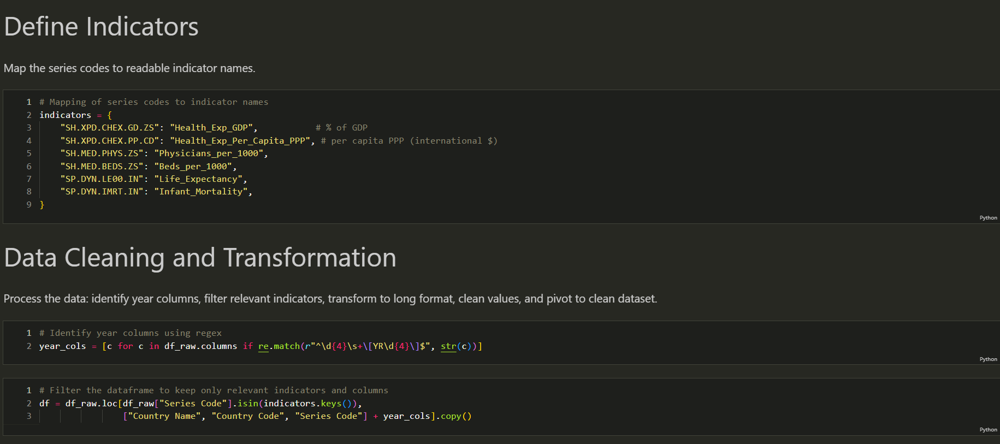
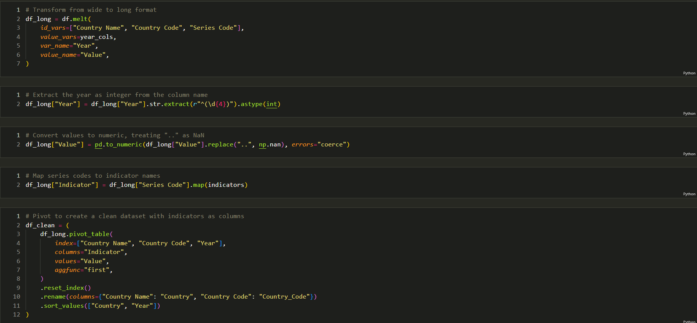
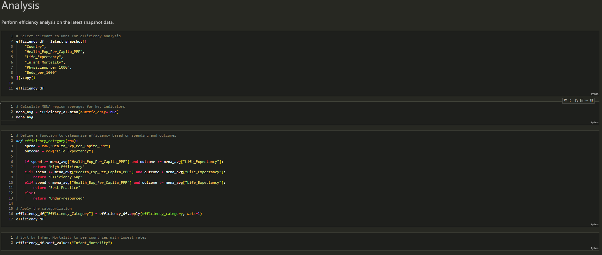
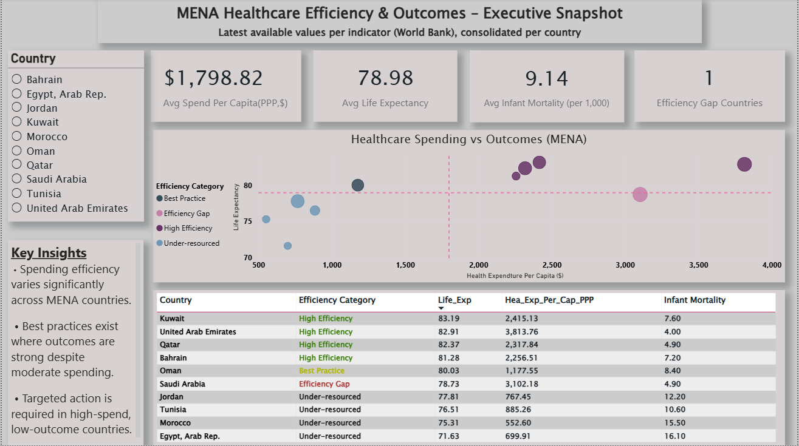

# MENA Healthcare Efficiency & Outcomes – Executive Snapshot
## Overview

This project analyzes healthcare spending efficiency across MENA countries, focusing on how effectively per-capita health expenditure translates into health outcomes.
The analysis adopts a consulting-style approach to support decision-making, benchmarking, and prioritization.

## Data

**Source**: World Bank – Health, Nutrition & Population

**Coverage**: Selected MENA countries

**Method**: Latest available value per indicator consolidated per country (to address public-sector reporting lags)

## Key Metrics

#### Health Expenditure per Capita (PPP)

#### Life Expectancy at Birth

#### Infant Mortality Rate

#### Healthcare Capacity (Physicians / Beds per 1,000) 

  

  

## Methodology

#### Cleaned and reshaped World Bank indicators (Python).

#### Consolidated the latest available value per indicator for each country.

#### Defined regional benchmarks (MENA averages).

#### Classified countries into Efficiency Categories based on spending vs. outcomes:

High Efficiency

Best Practice

Efficiency Gap

Under-resourced

#### Built an Executive Power BI Dashboard (Desktop + Mobile).

## Key Insights

**Efficiency varies significantly**: Higher spending does not consistently lead to better outcomes.

**Best practices exist**: Some countries achieve strong outcomes with moderate spending.

**Priority areas identified**: High-spend, low-outcome countries present clear efficiency gaps.

## Recommendations

**Target efficiency gaps**: Focus on operational and governance improvements where spending is high but outcomes lag.

**Scale best practices**: Benchmark top performers and replicate high-impact interventions regionally.

**Strengthen performance monitoring**: Implement unified health KPIs to reduce reporting delays and improve decision cycles.

## Deliverables

#### Executive Power BI Dashboard (Desktop & Mobile)

#### Clean analytical dataset

#### Consulting-style insights and recommendations

  

  

## Tools

#### Python: pandas, numpy (data cleaning & transformation)

#### Power BI: DAX, Executive dashboard design

**Data Source**: World Bank Open Data
